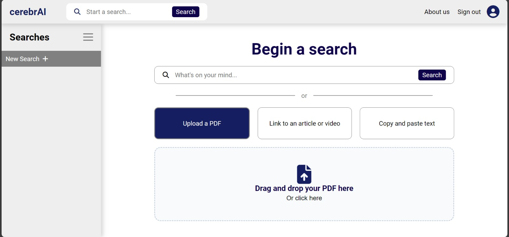

# HackMty-System32
Created by: 
- Fernando Morán
- Sergio González
- Luis Amado
- Rodrigo García

CerebrAI is a web application intented to be an all-in-one investigation tool, powered by AI. 

It can summarize multiple document types (videos, webpages, and text), as well as extract main keywords, and related links. It also has an AI chatbot, which can answer questions about the uploaded text or document. 

